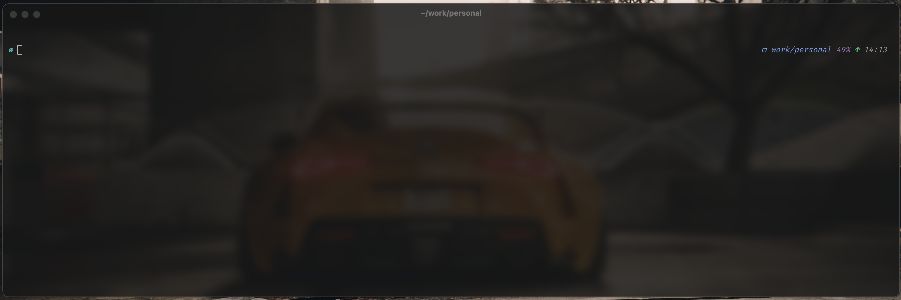

# ghostty-config

My configuration of Ghostty terminal

If you like what I share, I'd be happy if you bought me a coffee.

- Config file is located here [config](./config)

## How it looks like

## Setup

I also use [Starship](https://starship.rs) as prompt.
